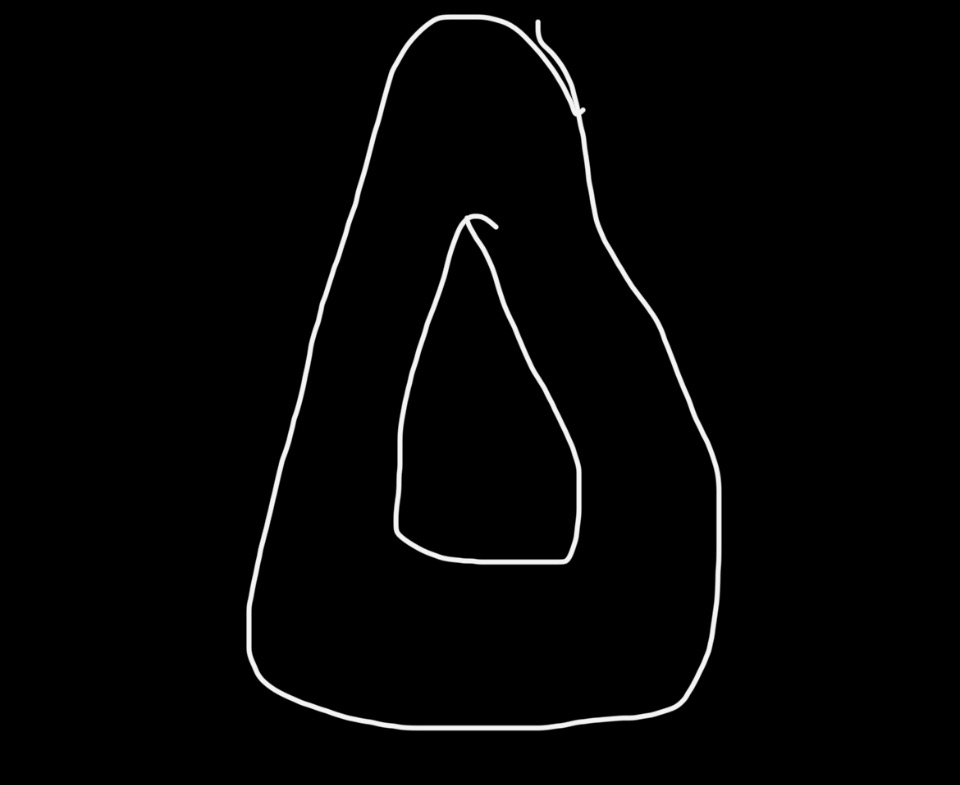

# Trifold — rotating-plate school programming studio

A single-file, dependency-free tool for programming a three-storey elementary school on one
traced floor plate that rotates 40° at every level. Drop programme bubbles onto a plate, drag
them, and the exterior wall bulges to meet them while the courtyard is squeezed back — inside
limits you set. Every move re-runs a constraint solver and re-costs the scheme against the
brief. When the massing holds up, export it to Rhino and Grasshopper.



Open `index.html` in a browser. There is no build step, no server and no network access — the
whole studio, including the sketch underlay, is in that one file.

---

## The idea

The sketch gives one plate: an outer teardrop (the exterior wall) with a triangular courtyard
punched through it. Levels 1 and 2 are the *same* plate, rotated. That single move creates the
problem the tool exists to solve:

**a rotated stack only overlaps itself in part, and a stair, lift or riser can only stand where
all three footprints agree.** That region — the shaded field in the plan and stack views — is
computed live and is the first thing that moves when you change the rotation angle, the
rotation centre, or whether the courtyard turns with its plate.

---

## What the solver does, every frame

Ordered so that hard facts beat soft intentions:

| # | Constraint | Behaviour |
|---|---|---|
| 1 | **Adjacency graph** | Positive weights pull spaces until they touch, negative weights hold them apart. Editable in *Adjacency*, overridable per space. |
| 2 | **Daylight** | Spaces flagged as daylight-dependent seek the nearest façade or courtyard edge and rest just inside the clearance zone. |
| 3 | **Egress** | Anything further from a core than the travel limit is drawn toward one. On the ground floor a door straight out through the exterior wall counts as an exit, which is how a school actually discharges. |
| 4 | **Separation** | Rooms are solid. Spaces separate by the corridor gap, small rooms giving way to large. This runs *after* the pulls above, so it always wins. |
| 5 | **Boundary response** | Each space presses on the wall it touches. The exterior wall bulges outward up to the flex limit; the courtyard is squeezed inward down to its minimum. Both are smoothed along the curve so the plate reads as a shape, not a set of dents. |
| 6 | **Containment** | Whatever the wall could not absorb pushes the space back inside instead. The plate is always a closed, buildable outline. |
| 7 | **Core stacking** | Cores marked as a stack are held at one world point through all three rotations. Drag one and the whole shaft follows. |

Drag a space and it becomes **hand-placed**: adjacency, daylight and egress stop pulling it,
but separation and containment still apply. *Release to solver* in the Selection panel hands it
back. That is the difference between a diagram that fights you and one you can actually design in.

---

## What it measures

**Metrics** — gross floor area, net programmed area, net:gross, m² per student, seat capacity
against the brief, teaching spaces, occupant load, façade length, envelope:GFA, building
height, shared core zone, core stack drift, and per-floor gross / net / efficiency / wall
deflection.

**Area schedule** — every programme type with its target (students × the planning ratio), what
is actually placed, unit count and variance, grouped by department and exportable to CSV.

**Checks** — capacity against the brief, net:gross against target, per-floor overflow, spaces
overlapping at high density, two remote exits per floor, travel distance to a core, core
alignment through the rotations, size of the shared zone, toilet provision per floor, daylight
access, assembly space above grade, and exterior wall saturated at its flex limit.

Every check names the remedy, not just the fault.

---

## Views

- **Plan** — the active floor in its own upright frame, with the other rotations ghosted, the
  undeformed sketch outline dashed behind, wall pressure highlighted, and dimensions, north
  point and scale bar.
- **Stack** — all three rotations in the world frame over the shared zone. The pinwheel.
- **Axon** — exploded isometric stacking diagram with the core shafts running through.
- **Section** — a true cut through the courtyard centroid: slabs, wall poché, and the rooms the
  cut passes through at each level.

---

## Getting it into Rhino and Grasshopper

**DXF** (`Export → 3D DXF`) — R12, opens natively in Rhino. All three plates as closed
polylines at true elevation and true rotation, plus programme circles and text labels, layered
`L0_EXTERIOR_WALL`, `L0_COURTYARD`, `L0_PROGRAM_CLASSROOM`, `L1_…` and so on.

**JSON** (`Export → Model JSON`) — the whole parametric model:

```
schema, generated, units, source
parameters      every slider and toggle, in model units
basePlate       the undeformed traced plate
floors[]        index, name, elevation, rotationDeg, floorHeight
                local  { outer, courtyard }        the floor's own upright frame
                world  { outer, courtyard }        rotated and lifted, ready for Rhino
                wallOffsets / courtyardOffsets     per-vertex deflection
                spaces[]  name, type, department, quantity, unitArea, totalArea,
                          radius, aspect, local, world, occupants, daylight,
                          locked, handPlaced, stackGroup, colour
                metrics   gross, net, circulation, netToGross, courtyard, facade,
                          occupants, teachingSpaces, maxWallPush,
                          maxCourtyardSqueeze, worstTravelDistance
commonCoreZone  area and the sampled points
adjacency, schedule, totals, checks
```

Then either:

- **`grasshopper/trifold_reader.py`** — paste into a GhPython component. Inputs `path`,
  `floor`, `solid`; outputs wall curves, courtyard curves, plate surfaces, programme circles
  with names, areas, types and colours, plus wall breps and slabs. Re-export from the studio
  and the component refreshes on file change.
- **`rhino/import_trifold.py`** — run with `_-RunPythonScript` in Rhino. Builds everything on a
  named layer tree and prints the schedule and checks to the command line.

Set the Rhino model units to match the export (`Rhino / Grasshopper → Model units`: meters,
millimetres or feet) before importing.

`samples/` holds a baseline export of the default 700-student brief in all three formats.

---

## Controls

| | |
|---|---|
| drag | move a space (it becomes hand-placed) |
| drag the ring handle | resize by area |
| double-click | place the last-used space |
| shift-click | multi-select |
| scroll | zoom · **space + drag** or **alt + drag** pan |
| arrows | nudge 0.5 m · **shift + arrows** one structural bay |
| `1` `2` `3` | switch floor · `F` fit · `G` grid · `L` lock · `Del` delete |
| `Ctrl+Z` / `Ctrl+Shift+Z` | undo / redo · `Ctrl+D` duplicate |

**Stack ×3** copies a space to the same world point on every floor and holds it there as the
plates rotate — that is how you make a core. **Re-site cores in the shared zone** solves for
core positions that minimise the worst travel distance while staying inside the region common
to all three rotations and keeping the exits remote from each other.

Work autosaves to `localStorage`; `Export → Session file` saves and reloads it as a file.

---

## Scripting the studio

`window.trifold` is a handle on the running model, for parametric studies from the console:

```js
trifold.set({ rotStep: 25, flex: 4, courtRotates: false });   // change params, re-solve
trifold.metrics.total;                                        // gfa, net, eff, capacity…
trifold.metrics.floors[1].egress;                             // worst travel on L1
trifold.siteCores();                                          // re-optimise core positions
trifold.model();                                              // the export payload
trifold.view('stack'); trifold.fit();
```

A sweep of rotation angles against the shared core zone, for instance:

```js
[0,10,20,30,40,50,60].map(a => {
  trifold.set({ rotStep: a });
  return [a, Math.round(trifold.metrics.common),
             trifold.metrics.floors.map(f => Math.round(f.egress))];
});
```

---

## A worked example

The studio opens on a 700-student brief at 40°, and it opens with a finding: worst travel
distance on the upper floors sits right at the 45 m limit. That is not a defect in the setup —
it is what a 40° rotation does to a plate this elongated. Rotating the courtyard along with the
wall sweeps a rosette through the middle of the building, so the only region common to all
three footprints is a thin arc, and every stair is forced into it.

Each remedy the check names is one control away, and the numbers move:

| | worst travel L0 / L1 / L2 | shared zone | findings |
|---|---|---|---|
| as shipped — 40°, courtyard turns | 14 / 45 / 47 m | 1,503 m² | 1 fail, 2 warn |
| hold the courtyard fixed | 17 / 33 / 29 m | 1,691 m² | **all pass** |
| ease the rotation to 25° | 12 / 42 / 40 m | 1,738 m² | 2 warn |
| hold the courtyard, rotate about the plate centroid | 21 / 36 / 31 m | 1,710 m² | 1 warn |

Holding the courtyard is the move: one void running straight up through three rotating plates
gives every level daylight to the same well, widens the region a shaft can stand in by 13%, and
brings travel distances comfortably inside the limit. Reproduce the table with the
`Courtyard rotates too` checkbox, or from the console with `trifold.set({courtRotates:false})`.

---

## Repository

```
index.html                          the studio — open this
assets/floorplate-sketch.jpg        the traced sketch, also embedded as the underlay
grasshopper/trifold_reader.py       GhPython component
rhino/import_trifold.py             RhinoPython importer
samples/                            baseline export, JSON + DXF + CSV
docs/model.md                       geometry, solver and schema notes
```

## Notes and limits

- Programme is represented as circles, so a plate cannot be packed as tightly as it could be
  with rectangular rooms. Above roughly 65% net:gross the spaces begin to overlap; the tool
  reports the overlap area rather than hiding it. Treat that as the signal to move programme
  to another floor or grow the plate, not as a solver failure.
- The travel-distance check uses a straight-line run with a 1.28 corridor detour factor. It is
  a massing-stage proxy, not a code compliance check; set the limit to whatever your code
  requires.
- Planning ratios in the programme library are defaults for a K–5 school. Edit them for your
  own standards — they drive every target in the schedule.
